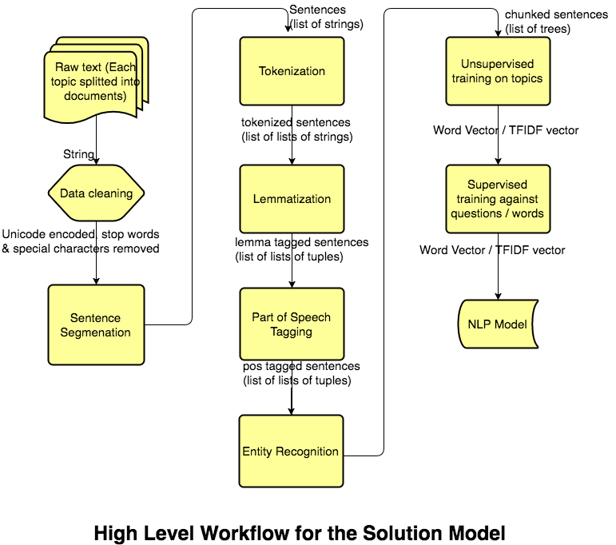
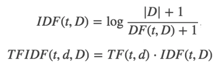
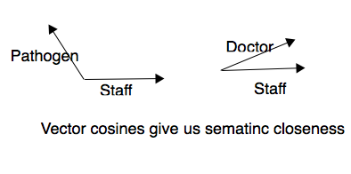

# Machine Learning Engineer Nanodegree
## Capstone Proposal
Rohan Shah  
December 15th, 2017

## Proposal

The objective of the capstone project is to build an NLP model that can perform information extraction from a set of Policies and Procedures documents  and can provide answer to questions related to those policies and procedures.

The project aims to build a Q&A system that can take as input any question related to the given policies & procedures set, perform information extraction from the indexed P&P documents and provide appropriate and correct answers for the questions. For this, the project will be using a sample set for the medical industry provided by **Physicians Medical Group of San Jose, Inc** available here - http://www.pmgmd.com/wp-content/uploads/2014/08/sample_office_policy_and_procedures.pdf

This document is also provided here [Sample Medical Policy And Procedures](dataset/sample_office_policy_and_procedures.pdf). The project will be referring only to this provided P&P document to perform the task of information extraction. 

### Domain Background

[BusinessDictionary.com](http://www.businessdictionary.com) defines Policies and Procedures as:

> A set of policies are principles, rules, and guidelines formulated or adopted by an organization to reach its long-term goals and typically published in a booklet or other form that is widely accessible.

> Policies and procedures are designed to influence and determine all major decisions and actions, and all activities take place within the boundaries set by them. Procedures are the specific methods employed to express policies in action in day-to-day operations of the organization.

> Together, policies and procedures ensure that a point of view held by the governing body of an organization is translated into steps that result in an outcome compatible with that view.

from:  http://www.businessdictionary.com/definition/policies-and-procedures.html

Thus, it can be clearly understood that the P&P documents serve as a very critical framework for organizations to run smoothly. They are necessitated not just by business goals but also are required to be adhered to by Federal, State & local level laws.

### Problem Statement

Every organization needs to ensure that its policies and procedures are followed in letter and in spirit. With employee attrition, frequent changes in laws & regulations, increased media scrutiny and an active social media, it is imperative for organizations to ensure that their employees / members have clear understanding of their policies and procedures. They need to ensure adequate trainings and understanding of these policies. 

However, for medium to large scale enterprises, it becomes too complex for the employees to keep up with the ever increasing policies and thus they need a clear and intuitive way to grasp them. Trainings and manuals do not provide a user friendly interface for complex scenarios. Advancement in search engines like Google have raised the expectation bar and question comes to mind - if Google can index the entire global cyberspace, why can't an organization provide an enhanced experience to its employees to help them resolve their concerns easily.

The P&P document used for this project is an example provided by [Physicians Medical Group of San Jose, Inc](http://www.pmgmd.com/wp-content/uploads/2014/08/sample_office_policy_and_procedures.pdf). 

Through this system, member of the medical staff having queries on policies and procedures can get the required answers. This will avoid the need to go through pages of documents to perform their daily tasks.

### Datasets and Inputs

As mentioned previously, the dataset for this project will be textual version of a sample P&P document provided by [Physicians Medical Group of San Jose, Inc](http://www.pmgmd.com/wp-content/uploads/2014/08/sample_office_policy_and_procedures.pdf).

This document has policies and procedures for a medical clinic / office that talks about performing activities like:
1. Facility Standards
1. Emergency plans
1. Office Procedures
1. Medical Records
1. Infection Control
1. Pharmaceuticals
1. ...

The data will be converted into a text corpus using NLTK and spaCy libraries (python libraries for Natural Language Processing)

Additionally, Google's Word2Vec pre-trained model will be used for vector embedding. This model will build up the vector space for english language. Transfer learning will then be applied to extend the model to cover the provided documents to enhance it for medical domain.

The test questions that would be used to evaluate the performance would be - [Test Question Set](dataset/test_questions.txt)

### Solution Statement

The NLP model for this project will be developed using Python programming language and will make use of the [NLTK](https://www.nltk.org/) and [spaCy](https://spacy.io) libraries. Standard NLP preprocessing tasks like tokenization of words, POS tagging will be performed. Model for Named Entity extraction and for relationship between entities and tasks will be developed using both Unsupervised and Supervised learning - 

* Perform tokenization of corpus and segmentation of sections, sentences and words 
* Perform POS(part of speech) tagging
* Identify set of relevant name entities used in the corpus
* Identify set of relations to be extracted (actions / tasks performed by named entities)
* Run TF-IDF and Vector Embedding separately to prepare 2 models (unsupervised training)
* Use Google's pre-trained Word2Vec model available for general use
* Optionally, hand Label questions against answers to improve accuracy using supervised learning.
* Additionally, hand label the relations between the entities and also actions / tasks to be performed by those named entities. 

### Benchmark Model
The underlying problem statement that the project aims to solve is Natural Language Understanding to perform Information Extraction through a Question And Answer format. As there wasn't an existing model for this, it was decided to look at the most closest system that attempted to solve the same problem - [Microsoft's QnA Maker](https://qnamaker.ai) tool. 

Since the QnA tool required the input to be provided in a question-answer format, the Sample P&P was converted to a Question and Answer format and uploaded to it to create a service called Medical_P_P_Final. From this the tool auto generated the NLU model and provided an interface to test and publish the model. The model was published and is accessible via the API:
````
POST /knowledgebases/4781de6d-6bed-40a8-94a1-f7f81411bc52/generateAnswer
Host: https://westus.api.cognitive.microsoft.com/qnamaker/v2.0
Ocp-Apim-Subscription-Key: eb30c063311741e5af6a323422f1d8d4
Content-Type: application/json
{"question":"Question here"}
````

Set of 142 questions were prepared and API requests were made for all of them. Each individual responses were manually validated and score of 0 was marked if the response was invalid and 1 if the model provided the correct response.

Sample request:
````
curl -d '{"question":"What needs to be done in case of emergency?"}' -H 'Content-Type: application/json' -H 'Ocp-Apim-Subscription-Key:eb30c063311741e5af6a323422f1d8d4' https://westus.api.cognitive.microsoft.com/qnamaker/v2.0/knowledgebases/4781de6d-6bed-40a8-94a1-f7f81411bc52/generateAnswer
````

Responses received for each question and the score value evaluated is provided in the worksheet - 

Here is the summary of the test results:
|Description|Count|
|-----------|-----|
|Total topics|34|
|Test Questions Count|142|
|Correct Responses|100|
|Incorrect Responses|42|
|Accuracy Score|70.42%|

Hence, the accuracy score for the model came out to approximate 70% using the test question set. Additionally, it was observed that if a question was asked whose answer was available only in the answer section in the knowledge base, the model could not provide a response. This meant that the baseline model only used the data from the questions of the converted knowledge base and did not consider its answer portion. This is one of a major drawback of the baseline model which the project aims to resolve.

### Evaluation Metrics
Accuracy score will be used to evaluate the performance of both the baseline and the solution model. Set of 142 questions against the Sample Medical P&P have been prepared [here](dataset/test_questions.txt) and the machine learning model will be evaluated on accuracy of answer to each of these questions. 

Answers to every question can be evaluated objectively in the sense that there can be only one particular answer for each question. The answer will basically be from one of the 34 possible documents (topics) as part of the corpus. How accurately the model is able to respond to the questions will be its evaluation metric.

Formula for the accuracy score:
````
Accuracy score =  (Number of questions correctly answered) * 100 / 142
````

### Project Design

The high level workflow behind this proposed model would be similar to a typical Natural Language Understanding Model. Written corpus of text is composed of documents and each document is made of sentences which are broken into words.



The workflow for building the model involves following steps:
1. Data Cleaning - The input corpus of documents is unicode encoded, special characters (URLs, email address, etc), stop words (a, the, etc) are removed.
1. Sentence Segmentation - Each document is split into list of strings with each list element representing a sentence. Sentence boundaries like '.', '?", '!' are used to identify sentence boundaries. However, abbreviations need to be taken care of so as not to introduce errors.
1. Tokenization - Word boundaries are correctly identified to split sentences to list of strings with each list member represented as a word. Abbreviations again would present a problem so they have to be handled carefully.
1. Lemmatization - Each word is annotated with its lemma form so as to determine the root of a word. For example - lemma of adults is adult; lemma of instruction is instruct, etc.
1. Part of speech tagging - Each word in the corpus is tagged with its part of speech so as to interpret the word as per the context. Additionally, homonyms, synonyms are also tagged for each word. These tags are used to perform entity recognition and extraction as per the question provided as input to the model.
1. Entity Recognition - Using parts of speech information, named entities are identified for each sentence and this information can be used to match with entities involved in the question that is provided as input to the model.
1. Unsupervised training on topics - The solution model will be trained by creating feature vector. Two popular methodologies will be used and the evaluation metric score will be compared between them. The 2 models that would be used are:
    * Term frequency - inverse document frequency (TF-IDF):
        * It assigns weight to keywords or key phrases found in a document to create feature vector
        * TF Portion considers how frequently a term appears in a document normalized by DF portion that considers how frequently the term appears across all documents
        * There are many ways to calculate TF-IDF for all keywords, this solution will be using the formula: 
        * 

    * Word Vector:
        * This model is developed using something called as Vector Embedding
        * It basically maps words, phrases, sentences to numerical vectors trained using a neural network based deep learning
        * Words with similar semantic meaning have cosine distance closer to 1 and dis-similar meaning have the cosine distance closer to 0
        * 
        * The solution model will use Google's Word2Vec model through Gensim Library
        * The Word2Vec model will be trained against all the documents to align it further towards medical domain
1. Supervised training - Based on performance of the unsupervised model, the solution will be fine tuned using supervised learning by providing additional set of questions and answers so that the accuracy and other metrics could be improved. Here too, both TF-IDF and Vector Embedding models will be used.

To conclude, the solution intends to be implemented in Python using following libraries:
* [NLTK](https://www.nltk.org)
* [spaCy](https://spacy.io)
* [Gensim](https://radimrehurek.com/gensim/)
* [Word2Vec Model](https://code.google.com/archive/p/word2vec/)
* [Scikit Learn](https://scikit-learn.org/)

Standard data science libraries like NumPy, Pandas, MatplotLib will be used as per needs.

-----------